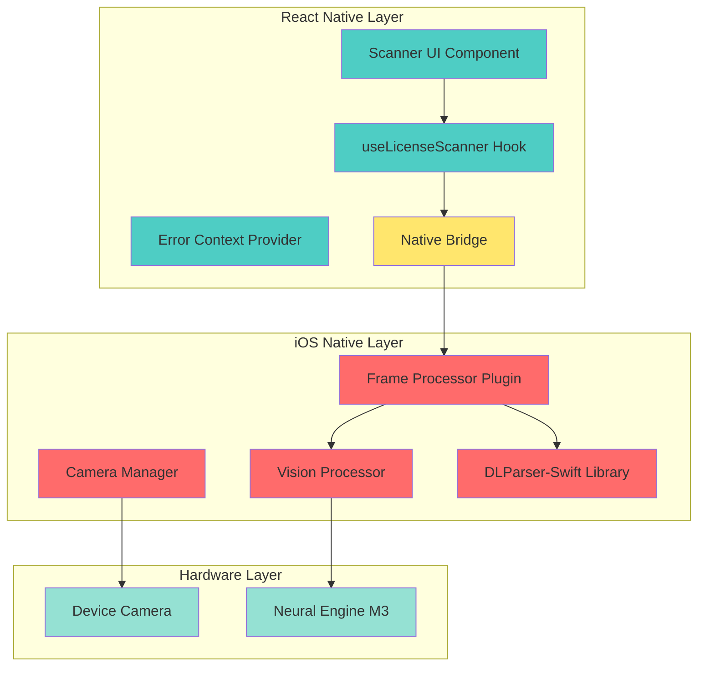
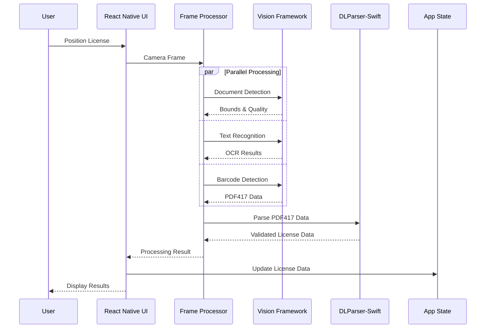
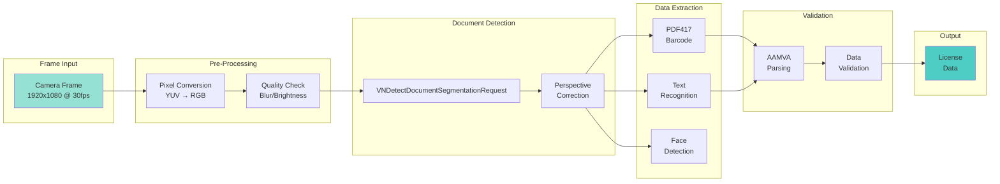
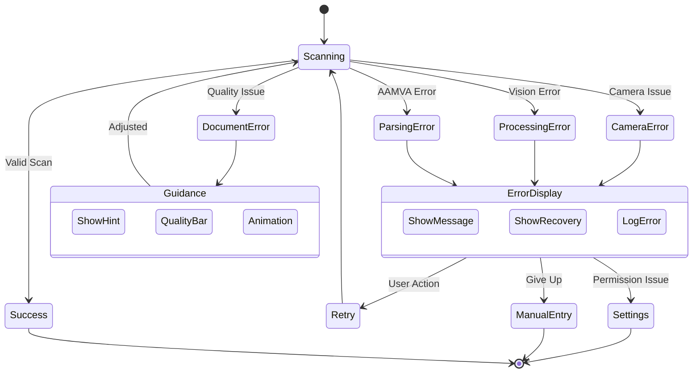
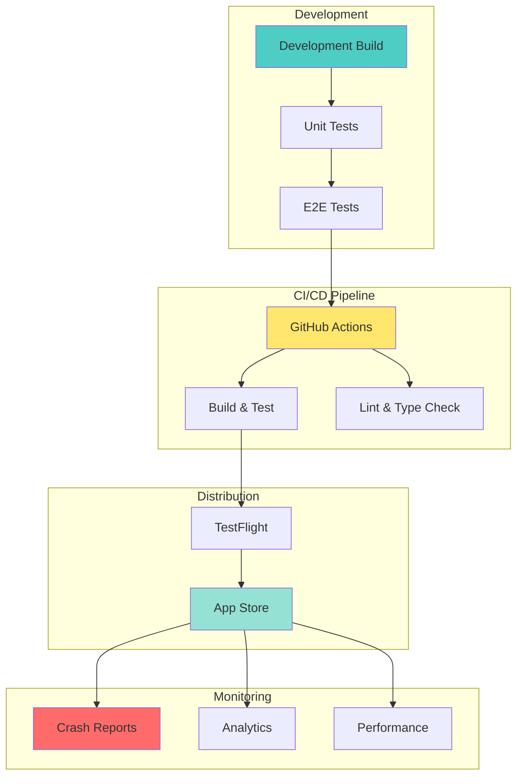

# Visual Architecture Diagrams for React Native License Scanner

## Overview

This document provides visual representations of the license scanner architecture using Mermaid diagrams and ASCII art for clear understanding of system components and data flow.

## 1. High-Level System Architecture



## 2. Data Flow Architecture



## 3. Component Architecture

```
┌─────────────────────────────────────────────────────────────┐
│                    React Native Application                  │
├─────────────────────────────────────────────────────────────┤
│  ┌─────────────────┐  ┌──────────────┐  ┌───────────────┐ │
│  │  Scanner Screen │  │ Result Screen│  │ Error Display │ │
│  └────────┬────────┘  └──────┬───────┘  └───────┬───────┘ │
│           │                   │                   │         │
│  ┌────────▼─────────────────────────────────────▼───────┐  │
│  │              License Scanner Component                │  │
│  │  ┌─────────────┐  ┌─────────────┐  ┌──────────────┐ │  │
│  │  │   Camera    │  │   Overlay   │  │   Guidance   │ │  │
│  │  │   View      │  │   Frame     │  │   Messages   │ │  │
│  │  └─────────────┘  └─────────────┘  └──────────────┘ │  │
│  └───────────────────────────┬──────────────────────────┘  │
├──────────────────────────────┼──────────────────────────────┤
│                              │                              │
│  ┌───────────────────────────▼──────────────────────────┐  │
│  │            React Native Vision Camera                 │  │
│  │                  Frame Processor                      │  │
│  └───────────────────────────┬──────────────────────────┘  │
├──────────────────────────────┼──────────────────────────────┤
│                     Native Bridge (JSI)                     │
├──────────────────────────────┼──────────────────────────────┤
│                              │                              │
│  ┌───────────────────────────▼──────────────────────────┐  │
│  │                iOS Native Module                      │  │
│  │  ┌────────────┐  ┌────────────┐  ┌────────────────┐ │  │
│  │  │   Vision   │  │   AAMVA    │  │    Camera      │ │  │
│  │  │ Processor  │  │   Parser   │  │    Manager     │ │  │
│  │  └────────────┘  └────────────┘  └────────────────┘ │  │
│  └──────────────────────────────────────────────────────┘  │
└─────────────────────────────────────────────────────────────┘
```

## 4. Frame Processing Pipeline



## 5. Error Handling Flow



## 6. Memory Management Architecture

```
┌─────────────────────────────────────────────────────────┐
│                   Frame Processor                       │
│  ┌─────────────────────────────────────────────────┐  │
│  │              Buffer Pool (3 buffers)             │  │
│  │  ┌──────────┐  ┌──────────┐  ┌──────────┐     │  │
│  │  │ Buffer 1 │  │ Buffer 2 │  │ Buffer 3 │     │  │
│  │  │   Active │  │Available │  │Available │     │  │
│  │  └─────┬────┘  └──────────┘  └──────────┘     │  │
│  └────────┼────────────────────────────────────────┘  │
│           │                                            │
│  ┌────────▼────────────────────────────────────────┐  │
│  │            Processing Queue (Serial)             │  │
│  │                                                  │  │
│  │  1. Acquire Buffer    ┌──────────────┐         │  │
│  │  2. Process Frame ───►│ Autorelease  │         │  │
│  │  3. Extract Data      │    Pool      │         │  │
│  │  4. Return Buffer     └──────────────┘         │  │
│  └─────────────────────────────────────────────────┘  │
└─────────────────────────────────────────────────────────┘
```

## 7. State Management Flow

```mermaid
graph TB
    subgraph "React State"
        LS[License State<br/>null | LicenseData]
        ES[Error State<br/>null | Error]
        PS[Processing State<br/>idle | scanning | processing]
    end
    
    subgraph "Actions"
        SS[Start Scan]
        DS[Detect Document]
        PD[Process Data]
        HD[Handle Error]
        RS[Reset State]
    end
    
    subgraph "Side Effects"
        CAM[Camera Active]
        FP[Frame Processing]
        AN[Analytics]
    end
    
    SS --> PS
    PS --> CAM
    CAM --> FP
    DS --> PS
    PD --> LS
    PD --> ES
    HD --> ES
    ES --> AN
    RS --> LS
    RS --> ES
    RS --> PS
    
    style LS fill:#4ECDC4
    style ES fill:#FF6B6B
    style PS fill:#FFE66D
```

## 8. Performance Optimization Architecture

```
┌─────────────────────────────────────────────────────────────┐
│                    Performance Pipeline                      │
├─────────────────────────────────────────────────────────────┤
│                                                             │
│  Camera Input     Frame Processing      Quality Control     │
│  ┌─────────┐      ┌─────────────┐      ┌──────────────┐  │
│  │ 30 FPS  │ ───► │ Downsample  │ ───► │   Quality    │  │
│  │ 1920x   │      │   to 10 FPS │      │   Check      │  │
│  │ 1080    │      │  if needed  │      │  (Sharp?)    │  │
│  └─────────┘      └─────────────┘      └──────┬───────┘  │
│                                                 │           │
│                   ┌─────────────────────────────▼───────┐  │
│                   │     Adaptive Processing Rate        │  │
│                   │  ┌────────┐  ┌────────┐  ┌──────┐ │  │
│                   │  │ Light  │  │ Medium │  │ Heavy│ │  │
│                   │  │ 15 FPS │  │ 10 FPS │  │5 FPS │ │  │
│                   │  └────────┘  └────────┘  └──────┘ │  │
│                   └─────────────────────────────────────┘  │
│                                                             │
│  Neural Engine    Parallel Tasks        Result Cache       │
│  ┌──────────┐     ┌─────────────┐      ┌──────────────┐  │
│  │ M3 Chip  │     │ • Document  │      │ Recent Scans │  │
│  │ 18 TOPS  │ ◄───┤ • Barcode   │ ───► │   (LRU)      │  │
│  │          │     │ • OCR       │      │              │  │
│  └──────────┘     └─────────────┘      └──────────────┘  │
└─────────────────────────────────────────────────────────────┘
```

## 9. Module Structure

```
react-native-dl-scan/
├── ios/
│   ├── LicenseScanner/
│   │   ├── Core/                    [Business Logic]
│   │   │   ├── VisionProcessor.swift
│   │   │   ├── DLParserIntegration.swift
│   │   │   ├── DocumentDetector.swift
│   │   │   └── QualityAnalyzer.swift
│   │   │
│   │   ├── FrameProcessor/          [Vision Camera Integration]
│   │   │   ├── LicenseScannerPlugin.swift
│   │   │   ├── FrameProcessorPlugin.h
│   │   │   └── BufferPool.swift
│   │   │
│   │   ├── Bridge/                  [React Native Bridge]
│   │   │   ├── RNLicenseScanner.m
│   │   │   ├── RNLicenseScanner.swift
│   │   │   └── ErrorTranslator.swift
│   │   │
│   │   └── Utils/                   [Helpers]
│   │       ├── ImageUtils.swift
│   │       ├── DateFormatter.swift
│   │       └── Logger.swift
│   │
│   └── LicenseScanner.podspec
│
├── src/
│   ├── components/                  [UI Components]
│   │   ├── LicenseScanner.tsx
│   │   ├── ScanningOverlay.tsx
│   │   ├── ErrorDisplay.tsx
│   │   └── ScanningGuidance.tsx
│   │
│   ├── hooks/                       [React Hooks]
│   │   ├── useLicenseScanner.ts
│   │   ├── useFrameProcessor.ts
│   │   └── useErrorRecovery.ts
│   │
│   ├── contexts/                    [State Management]
│   │   ├── ErrorContext.tsx
│   │   └── ScannerContext.tsx
│   │
│   ├── types/                       [TypeScript Types]
│   │   ├── license.ts
│   │   ├── errors.ts
│   │   └── dlparser.ts
│   │
│   └── utils/                       [Utilities]
│       ├── errorHandler.ts
│       ├── analytics.ts
│       └── storage.ts
│
├── __tests__/
├── example/
└── docs/
```

## 10. Deployment Architecture



## Interactive Architecture Viewer

For an interactive view of these diagrams, you can use the following tools:

1. **Mermaid Live Editor**: https://mermaid.live/
   - Copy any mermaid diagram code and paste it for interactive viewing
   
2. **Draw.io Integration**: 
   - Import these diagrams into draw.io for customization
   
3. **VS Code Extensions**:
   - Mermaid Preview
   - PlantUML

## Architecture Decision Records (ADRs)

### ADR-001: Use React Native Vision Camera
- **Status**: Accepted
- **Context**: Need high-performance camera access
- **Decision**: Use Vision Camera for JSI-based frame processing
- **Consequences**: Better performance, more complex setup

### ADR-002: Parallel Processing Strategy
- **Status**: Accepted
- **Context**: Multiple extraction methods needed
- **Decision**: Process OCR, barcode, and face detection in parallel
- **Consequences**: Faster processing, higher memory usage

### ADR-003: Error Recovery Approach
- **Status**: Accepted
- **Context**: Various failure modes possible
- **Decision**: Implement automatic retry with user guidance
- **Consequences**: Better UX, more complex error handling

## Conclusion

These visual representations provide a comprehensive understanding of the React Native license scanner architecture. The diagrams illustrate data flow, component relationships, and system design decisions that enable efficient, reliable license scanning on iOS devices.